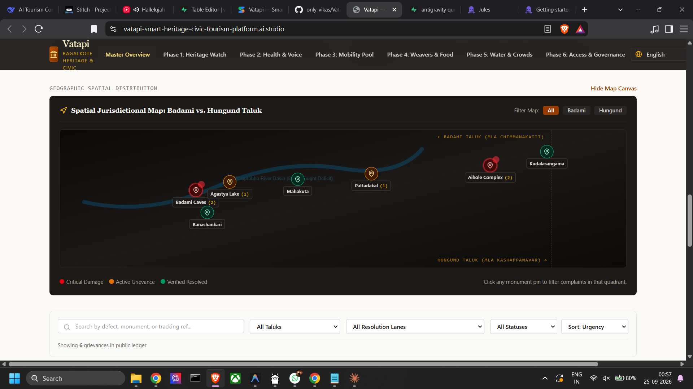
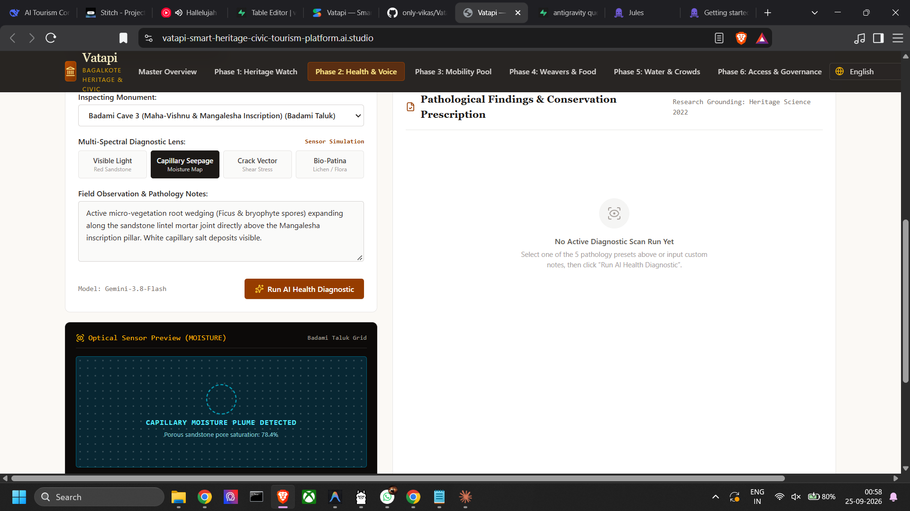
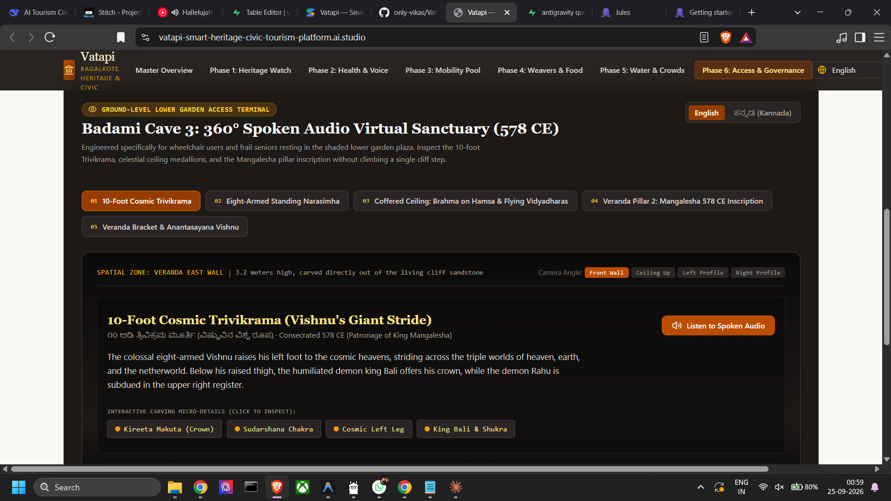

# Vatapi Heritage Platform

**Bagalkote Smart Heritage & Civic Tourism Platform**

The Vatapi Heritage Platform is a unified civic tourism and public accountability platform built to modernize the management and visitor experience of early Chalukyan sandstone architecture (6th-8th century CE Badami, Aihole, Pattadakal, Mahakuta) in the Bagalkote District.

This platform bridges the gap between heritage conservation, sustainable tourism, inclusive economic growth, and accessible public governance, ensuring that the legacy of these ancient sites is preserved while providing modern amenities and transparent civic oversight.


---

## 🏛 Platform Modules (6 Phases)

The platform is divided into 6 strategic phases designed to address various aspects of cultural tourism and public governance:

### 1. Phase 01 · Heritage Watch
**AI-Powered Structural Health & Conservation Ledger**
- Empowers the public and conservationists to submit visual reports of structural defects (e.g., crack morphology, micro-vegetation/lichen, salt efflorescence, human graffiti).
- Utilizes an AI model (Gemini) acting as a Senior Heritage Conservation Specialist to evaluate monument conditions based on conservation science and automatically generate actionable insights and ledger reports.



### 2. Phase 02 · Smart Tech
**Ticket Parsing & Multi-Modal Audio Tours**
- Implements seamless ASI ticket parsing combined with multi-lingual audio tour guides.
- Leverages cutting-edge tech to streamline entry processes and enrich the visitor experience with deep historical context.



### 3. Phase 03 · Mobility
**Circuit Planner & Shared Tempo Pooling**
- Bridges the critical transit gap between major sites (like Pattadakal–Aihole) with an intelligent circuit planner.
- Offers a transparent auto fare estimator and real-time seat pooling to meet tempo thresholds (e.g., KSTDC 8 AM tempo schedules).

### 4. Phase 04 · Inclusive Growth
**Weaver-to-Traveller & Ooru Oota Meals**
- Connects visitors directly with local artisans. Features Guledgudda Khana pit-loom bookings backed by verified textile studies.
- Provides an AI motif design assistant and a transparent directory of women-led SHG Khanavalis for authentic local meals (Jolada rotti, Ennegai) with zero hallucinations.

### 5. Phase 05 · Sustainability
**Agastya Water-Smart & Clean Trail**
- Addresses real-world environmental factors, monitoring the 7th-century Agastya lake water telemetry amidst drought conditions.
- Facilitates a dedicated civic laundry platform and crowd dispersal models to ensure sustainable local ecosystems.



### 6. Phase 06 · Universal Access
**Access Mode & District Executive Desk**
- Provides virtual 360° cave walkthroughs for seniors and wheelchair users who may be unable to navigate steep rock steps.
- Equips the District Administration with unified open governance metrics and profile-tailored routes.

---

## 🚀 Getting Started

Follow these steps to set up the project locally:

### Prerequisites

Ensure you have Node.js (>=18.x) and npm installed on your system.

### Installation

1. **Clone the repository:**
   ```bash
   git clone <your-repo-url>
   cd ai-studio-applet
   ```

2. **Install dependencies:**
   ```bash
   npm install
   ```

3. **Configure Environment Variables:**
   - Copy `.env.example` to `.env.local`:
     ```bash
     cp .env.example .env.local
     ```
   - Obtain a [Gemini API Key](https://aistudio.google.com/app/apikey) and add it to your `.env.local` file:
     ```env
     GEMINI_API_KEY=your_gemini_api_key_here
     ```

4. **Run the Development Server:**
   ```bash
   npm run dev
   ```

5. **Open your browser:**
   Navigate to `http://localhost:3000` to see the application in action.

---

## 🛠 Tech Stack

- **Framework:** [Next.js](https://nextjs.org/) (React 19)
- **Styling:** [Tailwind CSS](https://tailwindcss.com/)
- **AI Integration:** [@google/genai](https://www.npmjs.com/package/@google/genai)
- **Icons:** [Lucide React](https://lucide.dev/)
- **Animation:** [Motion](https://motion.dev/)

---

## 📚 Academic & Administrative Transparency

- **Academic References:** Crack detection and crowd-sensing methodologies referenced from *ACM Journal on Computing and Cultural Heritage (2023)* and *Heritage Science (2022)*. Handloom weaver socioeconomic analysis referenced from *Textile: Cloth and Culture (Peer-Reviewed, 2025)*.
- **Administrative Accuracy:** Taluk and district information accurately reflects the Bagalkote District (Badami, Hungund, Guledgudda, Bilagi, Jamkhandi, Mudhol). Operations and telemetry data are prototype models built for this platform.
